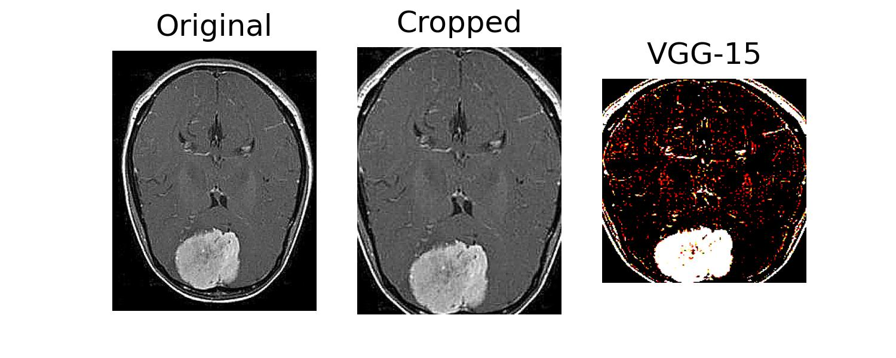
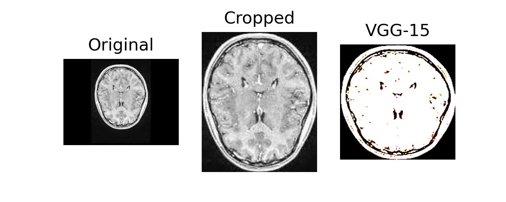

# Brain Pathology Detection with CNN



<br/><br/>

`Brain pathology` detection is a crucial task in medical imaging analysis for early detection of brain diseases that can significantly improve patient outcomes. In the Brain Pathology project, a deep learning model using convolutional neural networks (CNNs) is developed to detect brain pathologies from MRI images. The model, based on VGG-16 architecture, achieves an **accuracy of 90% on the test set and 99% on the val set**. The project provides the code and instructions to train, test, and deploy the model as a Flask web application. The application allows users to upload a brain MRI image and get a prediction on whether the image is normal or abnormal.

## Description

`Brain pathology` use the <u>VGG-16</u> model for transfer learning, which is trained on the ImageNet dataset. The model is fine-tuned on a custom dataset of brain images with and without pathology. The dataset consists of `5000` images. The model was trained on <u>Kaggle</u> and deployed on Flask. This project can be used as a starting point for building a more sophisticated medical image classification system.

</br>

## Dependencies

The following packages are required to run the code:

- `Python`: This is the programming language in which the FaceAB software is written. You can download and install Python from [here](https://www.python.org/downloads/release/python-391/).

```
> python --version
Python 3.9.1
```

### Requisites

1. Python:

   - `Python`: an interpreted, high-level, general-purpose programming language.
   - `TensorFlow`: an open-source software library for dataflow and differentiable programming across a range of tasks.
   - `Keras`: a high-level neural networks API, written in Python and capable of running on top of TensorFlow, CNTK, or Theano.
   - `Flask`: a lightweight WSGI web application framework.
   - `OpenCV`: a library of programming functions mainly aimed at real-time computer vision.
   - `Matplotlib`: a comprehensive library for creating static, animated, and interactive visualizations in Python.

   </br>
   All dependencies can be installed using pip:

   ```
   pip install -r requirements.txt
   ```

</br>

## Future Work

In the future, there are several opportunities for further development and improvement of this brain pathology classification project, such as:

- Expanding the dataset used for training the model, as a larger and more diverse dataset can potentially improve the model's accuracy and ability to generalize to new data.
- Exploring more advanced image preprocessing techniques to further enhance the quality of the input images for the model.
- Experimenting with different neural network architectures and hyperparameters to optimize the model's performance.

</br>

## Concluding

This project accurately classifies brain images into healthy and unhealthy categories with a high degree of accuracy. The success of this project can be attributed to the following key points:

- Extensive preprocessing techniques applied to the images
- Careful selection of the VGG-16 model as the classification algorithm

In the future, the project can be improved by considering the following opportunities:

- Expanding the dataset to include a wider range of brain diseases and conditions

- Incorporating other techniques such as transfer learning and data augmentation to further improve the accuracy of the model

In conclusion, the Brain Pathology project serves as a valuable tool in the detection and diagnosis of brain diseases and has the potential to make a significant impact in the field of medical imaging.

</br>

## Reference

The following are the references used in the development of this project:

- Keras. (n.d.). Keras documentation. Retrieved from https://keras.io/api/
- OpenCV. (n.d.). OpenCV documentation. Retrieved from https://docs.opencv.org/master/
- TensorFlow. (n.d.). TensorFlow documentation. Retrieved from https://www.tensorflow.org/api_docs
- Scikit-image. (n.d.). Scikit-image documentation. Retrieved from https://scikit-image.org/docs/stable/api/api.html
